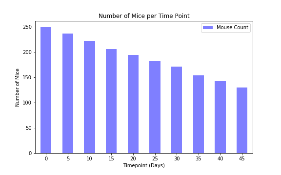

In the study, the maximum period for squamous cell carcinoma treatment was 45 days. 250 mice started the regimen treatment (at timepoint 0), but only 130 went through the 45-day treatment.

Looking into gender, almost identical numbers of female and male were studied.

The capomulin treatment was the most effective because the mice treated with capomulin had the lowest final tumor volume. The tumor volume decreased from 45mm3 to 36mm3 after the treatment.

The slope of 1.01 and the correlation coefficient value of 0.95 indicates that there's a strong positive relationship between mouse weight and tumor volume. In other words, the tumor volume is strongly dependent on the weight.